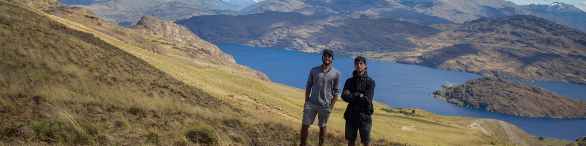

# Hi, I'm Jorge Hewstone 👋

**Senior Data Scientist · Civil Engineer in Mathematics · AI & MLOps**

Based in Santiago, Chile 🇨🇱

I design and build **end-to-end AI, Machine Learning and data solutions**, from problem definition and data modelling to production deployment, monitoring and business adoption.

My background combines strong mathematical foundations with hands-on experience in **Data Science, Generative AI, cloud platforms, software development and technical leadership**. I particularly enjoy working on complex problems where modelling is only one part of the solution and where technology must ultimately support a real operational or business decision.

---

## 👨‍💻 What I do

I currently work as a **Senior Data Scientist at Acid Labs, supporting Banco de Chile**, where I develop large-scale Machine Learning and analytical systems for fraud-risk decisioning.

My work includes:

- Designing and validating **Machine Learning and statistical models**
- Building large-scale data pipelines with **Python, SQL, BigQuery and GCP**
- Developing reproducible and production-oriented ML workflows
- Designing automated validation, testing and model-quality controls
- Translating operational constraints into quantitative decision strategies
- Working with Data Engineering and business teams to move models from experimentation to production
- Contributing to architectures for both batch and low-latency ML systems

Previously, I worked in health insurance, EdTech and academic research, developing solutions in areas including **fraud detection, risk modelling, customer analytics, Graph Neural Networks, Generative AI, RAG and agentic systems**.

---

## 🧠 Areas of interest

- Machine Learning & Statistical Modelling
- Artificial Intelligence
- Generative AI & LLM Applications
- RAG & Agentic Systems
- Graph Machine Learning
- MLOps & Production ML
- Cloud-native AI systems
- Decision Intelligence
- Mathematical Optimisation
- Data Engineering & Analytics

I am especially interested in applying these tools to **complex operational and industrial problems**, where AI can improve decision-making, efficiency and resource allocation.

---

## 🛠️ Technologies

### Data Science & Machine Learning
`Python` · `PyTorch` · `Scikit-learn` · `TensorFlow` · `Pandas` · `NumPy` · `XGBoost`

### Generative AI
`LLMs` · `RAG` · `Agentic Workflows` · `LangChain` · `Prompt Engineering` · `Vector Retrieval`

### Cloud & Data
`Google Cloud Platform` · `BigQuery` · `SQL` · `ETL/ELT` · `Data Modelling`

### MLOps & Software
`Git` · `Docker` · `Kubernetes` · `Cloud Run` · `FastAPI` · `MLflow` · `Automated Testing`

### Analytics
`Business Intelligence` · `KPI Design` · `Data Visualisation` · `Operational Analytics`

---

## 🎓 Education

**MSc in Data Science**  
University of Chile  
Final grade: **6.6 / 7.0**

**Civil Engineering in Mathematics**  
University of Chile  
Final grade: **7.0 / 7.0**

My academic background includes probability, statistics, optimisation, numerical methods, stochastic processes, algorithms and mathematical modelling.

---

## 📚 Research

My research experience includes Machine Learning, audio processing and mathematical optimisation.

- **Hewstone, J. & Araya, R. (2023)**  
  *Neural Network-Based Approach to Detect and Filter Misleading Audio Segments in Classroom Automatic Transcription*  
  Applied Sciences, 13(24), 13243.

- **Hewstone Correa, J. (2024)**  
  *New Directions in Optimal Stopping: Methodologies for Trading Problems with Prophet Inequalities*  
  MSc Thesis, University of Chile.

---

## 🚀 Selected projects

I use this GitHub to share selected personal, academic and technical projects involving:

- AI and Machine Learning applications
- Generative AI
- Mathematical modelling
- Production-oriented ML
- Data engineering
- Software and application development

Some of my professional work involves confidential or proprietary systems, so those repositories are naturally not public.

---

## 🌎 A little more about me

*On the left, travelling through Chilean Patagonia with one of my best friends.*

Outside of technology and mathematics, I enjoy travelling, exploring Chile and building side projects that allow me to learn new technologies from first principles.

---

## 📫 Contact

- 🌐 [jorgehewstonecorrea.com](https://jorgehewstonecorrea.com/)
- 💼 [LinkedIn](https://www.linkedin.com/in/jorge-hewstone-correa-675120195/)
- 📧 [jorgehewstonec@gmail.com](mailto:jorgehewstonec@gmail.com)

